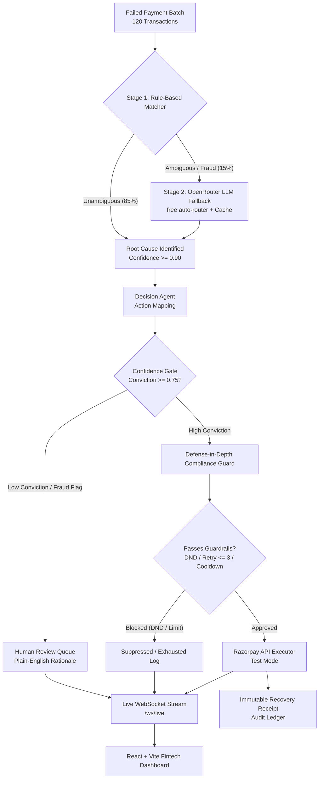

# Recovr — Autonomous Revenue Recovery Agent

> **AI-Powered Revenue Recovery with Confidence-Gated Interventions, Root Cause Detection & Defense-in-Depth Compliance for Razorpay's AI Buildathon (Track 3)**

[](http://localhost:5173)
[](docs/DEMO_NOTES.md)
[](docs/DECISIONS.md)

---

## 🎯 Problem Statement

Online merchants lose **15% to 30% of their top-line revenue** to failed transactions (insufficient funds, bank downtime, card declines, false-positive fraud flags). Naive payment recovery systems blindly retry every failed charge, leading to:
1. **Wasted Gateway Fees & Exhaustion**: Retrying hard declines like expired cards or insufficient funds immediately is futile and annoys customers.
2. **Catastrophic False Positive Retries**: Retrying fraud-adjacent signals risks chargebacks, network fines, and regulatory non-compliance.
3. **Zero Explainability**: Merchants have no visibility into *why* a payment failed or *why* a recovery action was selected.

**Recovr** solves this with an **autonomous, confidence-gated recovery agent**:
- **Two-Stage Classifier**: High-speed deterministic regex rules (85%) + OpenRouter LLM fallback (15%).
- **Confidence Gating**: High conviction (&ge; 0.75) triggers automated Razorpay execution (Payment Links, Instant Retries, Card Update Prompts); low conviction (&lt; 0.75) or fraud flags route to Human Review.
- **Defense-in-Depth Compliance Guard**: A non-bypassable programmatic gate enforcing DND suppression, 3-retry maximum cap, and a 4-hour cooldown.
- **Immutable Recovery Receipts**: Human-readable audit certificates generated for every terminal action.

---

## 🏗️ Architecture & Pipeline Flow



---

## 📊 Benchmark Uplift vs Naive Baseline

In our standardized benchmark run on 120 synthetic Indian merchant transactions (₹3,29,993 total value at risk):

| Metric | Naive Blind Retry | Recovr AI Agent | Net Advantage |
|---|---|---|---|
| **Transactions Recovered** | 34 / 120 (28.3%) | **66 / 120 (55.0%)** | **+32 Recovered Transactions** |
| **Total Revenue Recovered** | ₹1,18,741 | **₹1,60,446** | **+₹41,705 Incremental Yield** |
| **Recovery Uplift (%)** | Baseline (0.0%) | **+35.1% Uplift** | **+35.1% Pure Revenue Lift** |
| **Fraud Risk False Positives** | 6 Unsafe Retries | **0 Retries (100% Escalate)** | **Zero Chargeback Risk** |
| **DND Opt-Out Compliance** | 0% Guarded | **100% Suppressed (7 blocked)** | **100% Regulatory Compliance** |

---

## 🚀 Quick Start (Run Locally)

### 1. Prerequisites
- Docker (for PostgreSQL 16)
- Python 3.11+
- Node.js 18+ and npm

### 2. Start PostgreSQL
```bash
docker compose up -d postgres
```

### 3. Backend Setup
```bash
cd backend
python -m venv .venv

# Windows:
.venv\Scripts\activate
# macOS/Linux:
source .venv/bin/activate

pip install -r requirements.txt
cp .env.example .env   # Add OPENROUTER_API_KEY / RAZORPAY test keys

# Initialize Schema and Run Migration
alembic upgrade head

# Seed 120 Synthetic Transactions
python -m scripts.generate_batch

# Start Backend Server
uvicorn app.main:app --reload --port 8000
# Backend API Live at http://localhost:8000/docs
```

### 4. Frontend Setup
```bash
cd frontend
npm install
npm run dev
# Frontend Dashboard Live at http://localhost:5173
```

---

## 🎥 Pitch Video & Demo Recording

- **Pitch Video:** [Watch Pitch Video (YouTube / Loom) — *Link to be inserted*](https://youtube.com)
- **Live Demo Video (Browser Artifact):** `recovr_final_qa.webp`

---

## 🛠️ Technology Stack

- **Backend**: FastAPI, Python 3.11+, SQLAlchemy, Alembic, PostgreSQL 16, Pydantic v2, Uvicorn, WebSockets.
- **Frontend**: Vite, React 18, TypeScript, Tailwind CSS, TanStack Query v5, Framer Motion, Recharts, Lucide Icons.
- **AI Engine**: OpenRouter Free Auto-Router (`openrouter/free`) with in-memory regex caching and exponential backoff.
- **Payment Integration**: Razorpay Python SDK (Test Mode / Mock fallback).

---

## 📑 Engineering Trail & Documentation

- [`docs/FAILURE_LOG.md`](docs/FAILURE_LOG.md) — Mandatory technical failure log across all phases.
- [`docs/DECISIONS.md`](docs/DECISIONS.md) — 10 Architecture Decision Records (ADRs).
- [`docs/DEMO_NOTES.md`](docs/DEMO_NOTES.md) — Complete demo guide mapped to the 4 Hackathon judging criteria.
